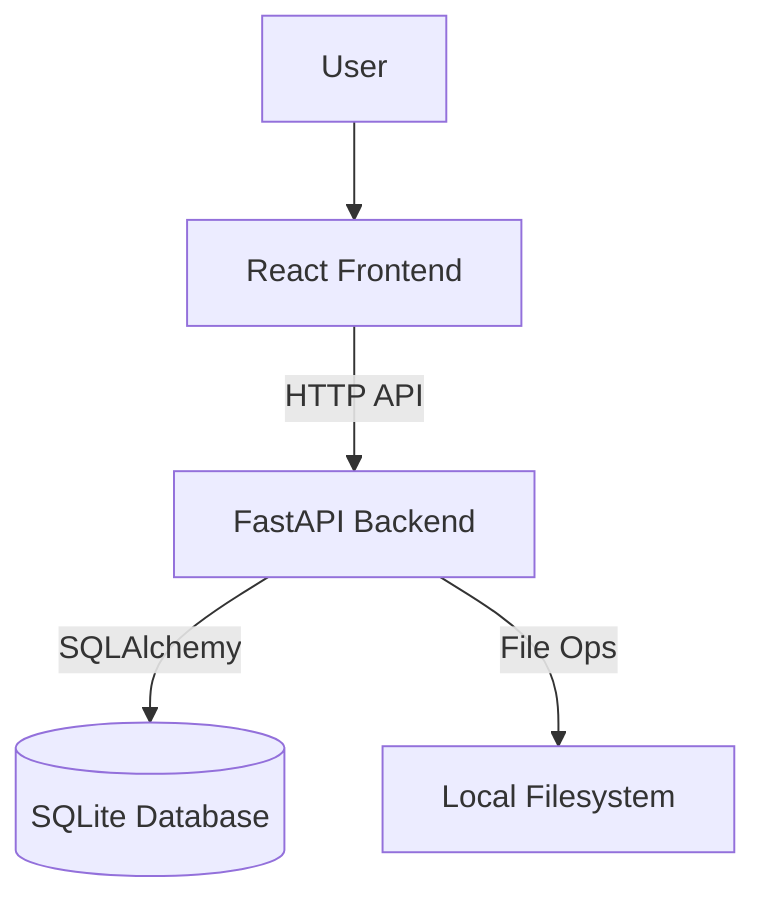

# System Patterns

## Architecture

The application follows a classic Client-Server architecture, but running entirely locally.

## Backend Design

- **FastAPI:** Handles HTTP requests.
- **SQLite:** Stores wallpaper metadata, ratings, and comparison history.
- **TrueSkill:** Used for calculating ratings.
- **Scanner:** Recursively finds images.
- **Image Processing:** `Pillow` is used for on-the-fly image resizing to optimize frontend performance.
- **Caching:** A local filesystem cache (`.cache` directory) stores generated thumbnails to prevent redundant processing.
- **Module Execution:** The backend is designed to be run as a Python module (`python -m backend.run`) to ensure correct relative imports and package resolution.

## Frontend Design

- **React + Vite:** SPA framework.
- **shadcn/ui:** Component library for consistent design.
- **Tailwind CSS:** Utility-first styling with a custom **Dark Mode** theme (Zinc palette).
- **State Management:** React Context (`AppContext`) for global app state (current view, progress, current ranking pair).
- **API Layer:** `fetch` wrapper (`api.ts`) for backend communication.
- **Layout Strategy:**
  - **Minimalist Container:** `Layout.tsx` provides a clean, full-screen container without heavy chrome.
  - **Immersive Views:**
    - `ScanView`: Centered, focus-driven input.
    - `RankView`: Split-screen layout maximizing image visibility. Implements **preloading** and **optimistic updates** for instant navigation.
    - `ReviewView`: Clean grid for efficient management. Uses **thumbnail** images to handle large lists efficiently.

## Key Workflows

1. **Scanning:** Frontend sends path -> Backend scans -> Returns count.
2. **Ranking:** Frontend requests pair -> Backend selects pair -> Frontend displays -> User votes -> Backend updates ratings.
3. **Reviewing:** Frontend requests low-rated -> Backend queries DB -> Frontend displays list -> User moves file -> Backend moves file & updates DB.
